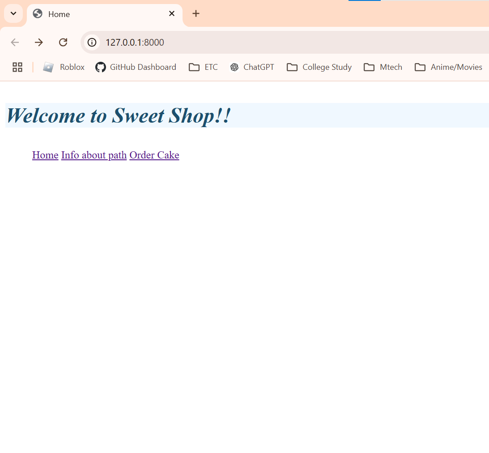
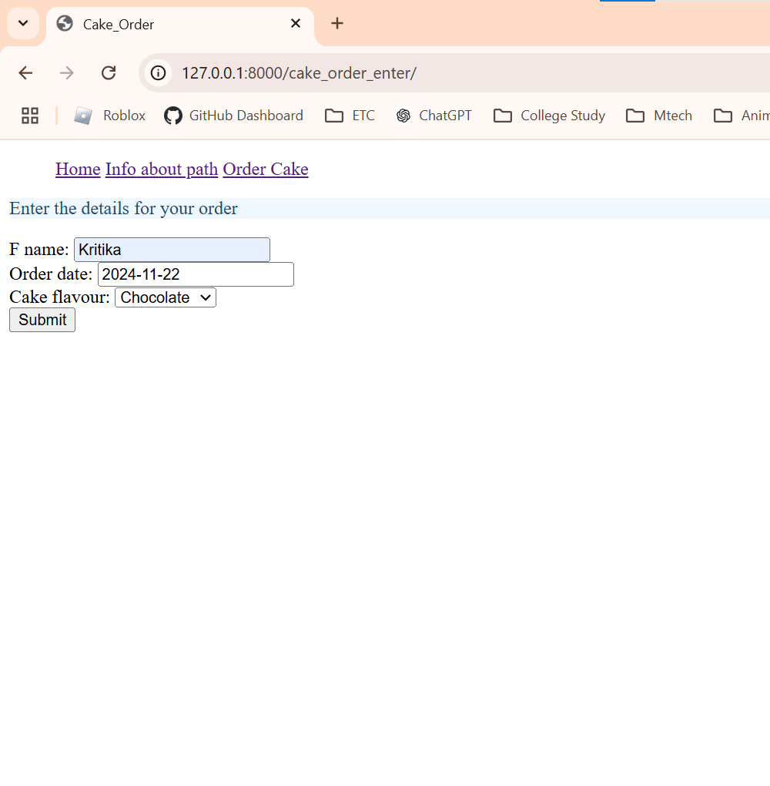
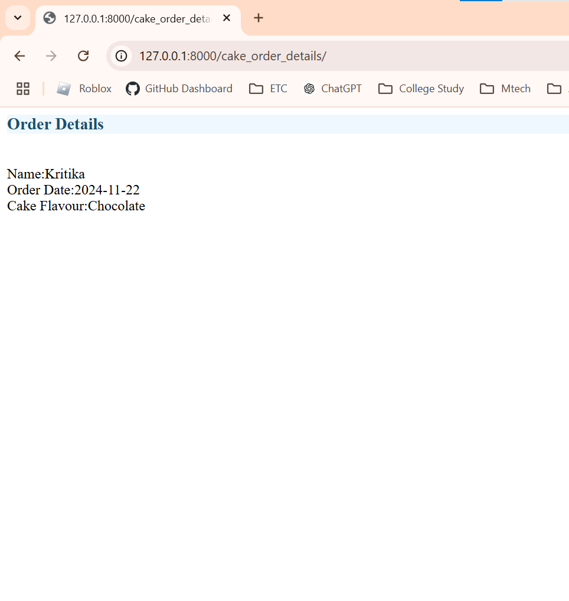
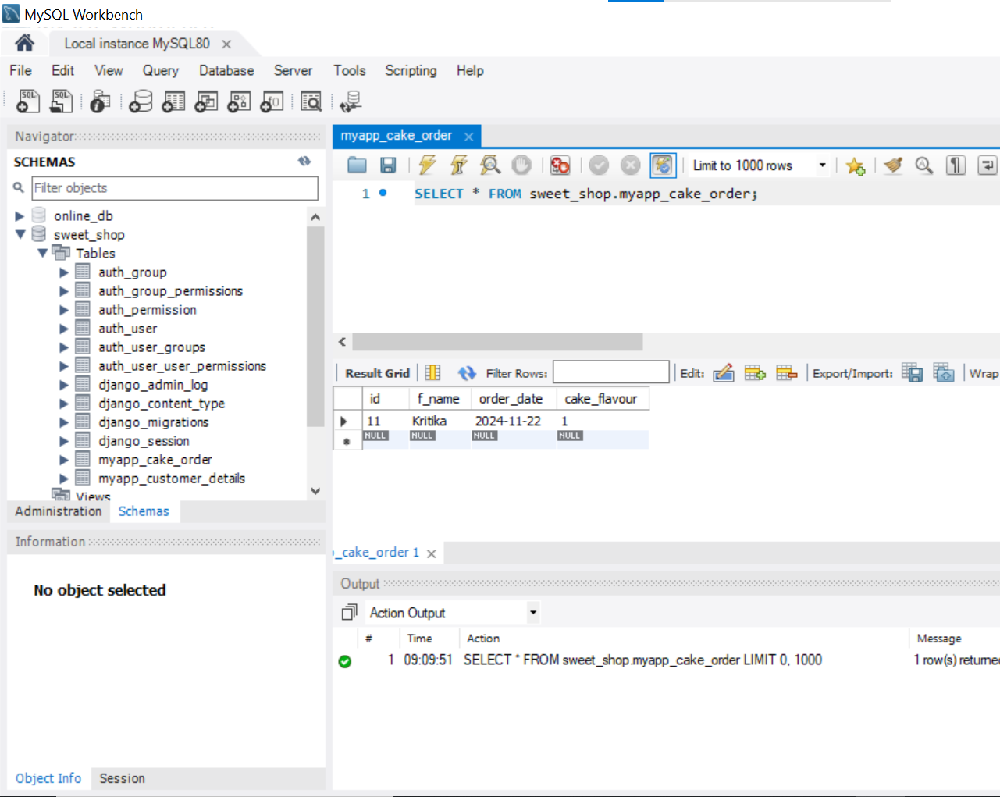

# Creating a django project using coursera

- Site to order cakes.
- [Link to models.py(myapp)](myproject/myapp/models.py)
- Home page

- Order page

- Order details page

- Database for storing orders
<kbd></kbd>

